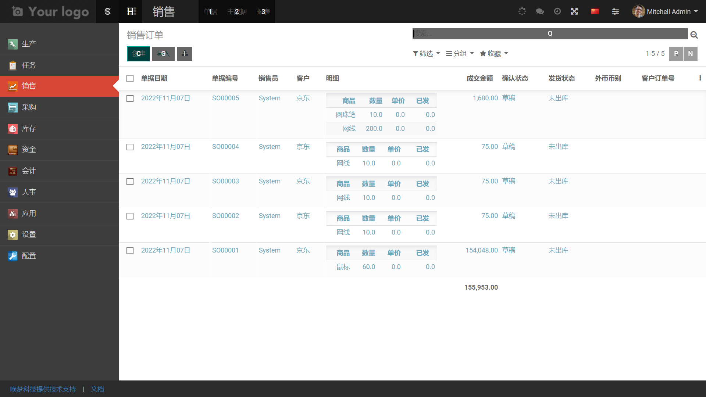

# hm-erp

#### 介绍
基于python开发的erp，成熟的商用ERP/CRM/MES软件 ，模块化结构，有几百个模块， 自由安装卸载，特意加入了生产模块，，福利发放
 
可以有绿色版  ,源代码，

ERP 体验网址 ：  http://erp.dreammm.net
数据库 demo
账户  demo
密码  demo

需要admin账户体验的的私信我

可以在 windows  或者 linux 下面部署使用

runtime 下面的 内容 太多， 不方便上传 ， 需要的 单独 给我发消息 ，

销售

####可以结合mes系统使用
#### 生产看板

http://47.240.54.105:8081

#### 软件架构
软件架构说明

web框架主要基于 werkzeug，
后端基于python ，数据库是 pgsql，

前端 是 js + 模板 

#### 安装教程
有文档

#### 使用说明

#### 联系方式  

手机微信 18665802636
QQ  75039960

