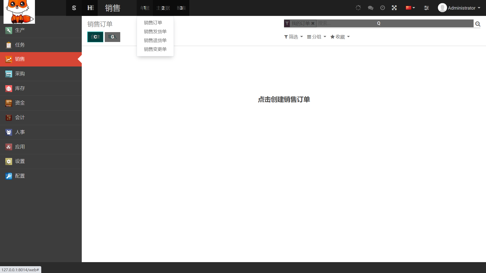
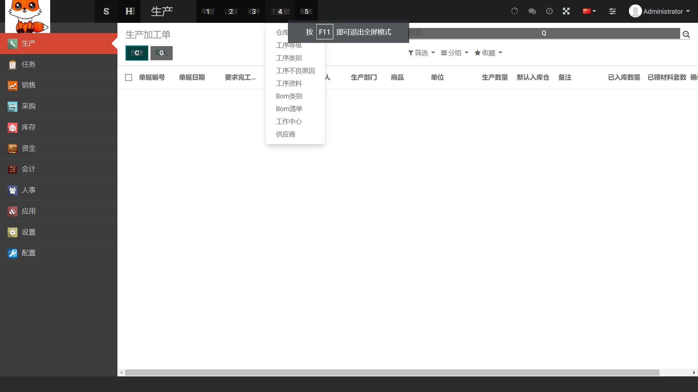

# hm-erp

#### 介绍
基于python的 开源erp，非常成熟的商用ERP/CRM/MES软件 ，   特意加入了生产模块，这部分本来是企业版才有的功能 ， 发放福利了
 
绿色版  ,源代码，

可以在 windows  或者 linux 下面   使用

runtime 下面的 内容 太多， 不方便上传 ， 需要的 单独 给我发消息 ，免费 发放 ，

生产看板

http://47.240.54.105:8081

#### 软件架构
软件架构说明

hmerp  代码 是 关键 

#### 安装教程

#### 使用说明

#### 联系方式  

手机微信 18665802636
QQ  75039960

#### 参与贡献

#### 特技

